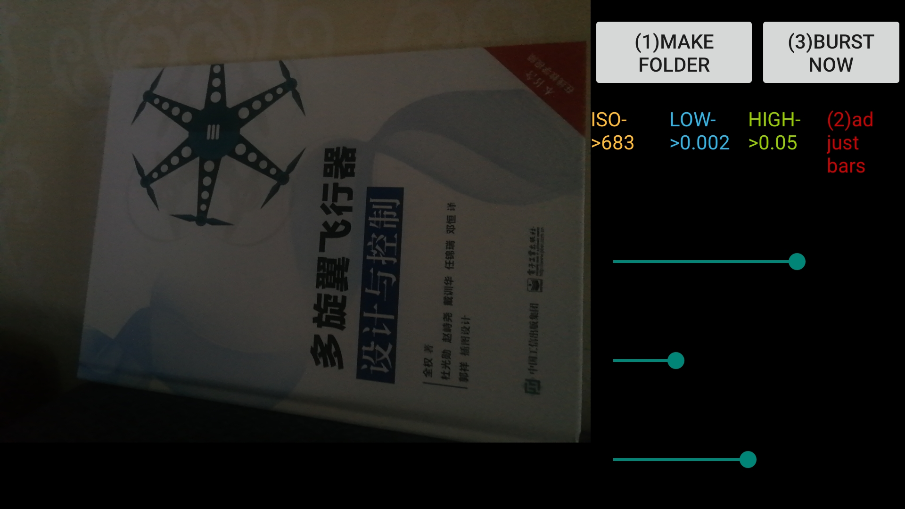

# ExtremeLowLight
Code&amp;Dataset : Learning an Adaptive Model for Extreme Low-light Raw Image Processing

# DATASET
CID (Campus Image Dataset) is a dataset capture in low-light env with the help of Android programming.
Its basic unit is group, which is named by capture time and contains 8 expoure-time-varying raw image shot in a burst.

e.g.

## Capture Program

Run on android platform, on some old device it seems that it has compatibility problem, please build from source.

source: /Camera Raw Burst/*

apk:    /Application-debug.apk

This program is based on Google Camera2RAW project, and developed in a very limited time to serve very specific purpose.
Thus, the UI is not well designed, you might need more time to understand it.

Android SDK required:Android 8 Oreo API Level 26
        minSdkVersion 21
        targetSdkVersion 26
Gradle required:gradle-4.4  (https:/services.gradle.org/distributions/gradle-4.4-all.zip)

usage:
(1) Press the Make Folder button to make a working dir in /storage/emulated/0/000dateset/. All images captured will be put into 000dateset folder.
(2) Adjust 3 seekbars (ISO, shortest exposure time, longest exposure time.
(3) Fix the device, press the BIG burst button to commit burst. Now the program will play a music as a reminder that you shoud  HAND OFF the cam,
and the program will sleep for a few seconds, waiting for the vibration of tripod to decrease.
Meanwhile the screen no longer update, because the burst must be finished as fast as possible and screen update will interrupt this process.
(4) Press burst again or exit and find the results in  /storage/emulated/0/000dateset/

## DATASET File Organization

1、For trainning, provided as group

2、For evluation, provided as group or single

## DATASET Download

OneDrive : https://stuhiteducn-my.sharepoint.com/:f:/g/personal/1150700117_stu_hit_edu_cn/EumyrYnHDMtIiNoAHNshbXUBHU5diRWyGVB1rmso860kog?e=KKEKOO

# Pretrained Model Download

OneDrive : https://stuhiteducn-my.sharepoint.com/:u:/g/personal/1150700117_stu_hit_edu_cn/Edor2A427PtElKU6Y0ewvysBv0t3k0UM43mE2xxDFGenlQ?e=VqEyhG

